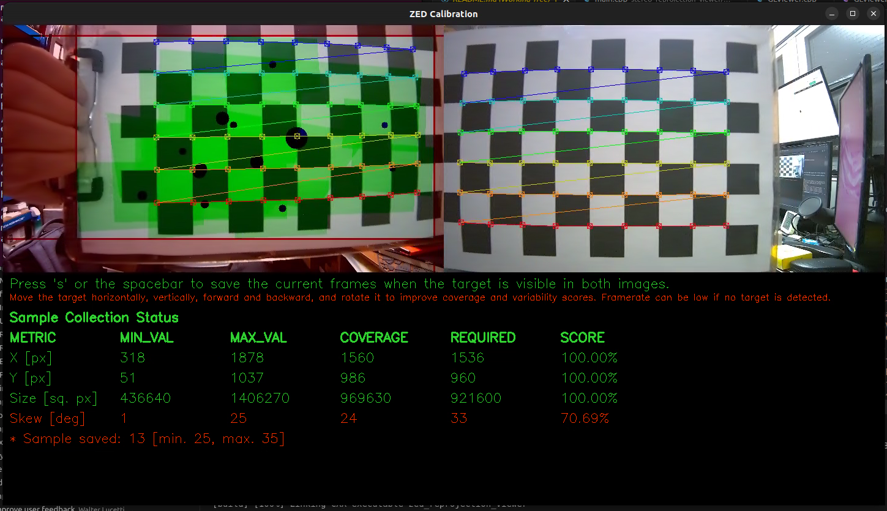

# ZED OpenCV Calibration

A camera calibration toolkit for ZED cameras using OpenCV.

## Overview

This project provides five main applications for working with ZED cameras:

1. **Monocular Calibration Tool** - Interactive calibration for single ZED X One cameras.
2. **Monocular Calibration Checker** - Live reprojection error monitor to validate monocular calibration quality.
3. **Stereo Calibration Tool** - Interactive calibration data acquisition and processing for stereo cameras and virtual stereo rigs.
4. **Stereo Calibration Checker** - Live reprojection error monitor to validate stereo calibration quality.
5. **Stereo Reprojection Viewer** - Real-time reprojection tool to visualize calibration results on unrectified images.

## Requirements

### Dependencies

- **ZED SDK** (version 5.1 or higher)
- **OpenCV** (4.x recommended)
- **CUDA** (compatible with ZED SDK version)
- **OpenGL libraries**:
  - GLEW
  - FreeGLUT
  - OpenGL
- **CMake** (3.5 or higher)
- **C++17** compatible compiler

## Installation and building

### Build Instructions

Open a terminal on your Linux system and execute the following commands:

```bash
git clone https://github.com/stereolabs/zed-opencv-calibration.git
cd zed-opencv-calibration

# Build all tools
mkdir build && cd build
cmake ..
make -j$(nproc)
```

## Usage

### Monocular Calibration

The **Monocular Calibration Tool** computes intrinsic camera parameters (focal length, principal point, distortion coefficients) for a single ZED X One camera using a checkerboard pattern.

#### Run the Monocular Calibration

```bash
cd build/monocular_calibration/
./zed_mono_calibration
```

This command opens the first connected ZED X One camera for live calibration using the default checkerboard settings.

```bash
Usage: ./zed_mono_calibration [options]
  --h_edges <value>      Number of horizontal inner edges of the checkerboard
  --v_edges <value>      Number of vertical inner edges of the checkerboard
  --square_size <value>  Size of a square in the checkerboard (in mm)
  --svo <file>           Path to the SVO file.
  --fisheye              Use fisheye lens model.
  --id <id>              Camera ID of the ZED X One.
  --sn <sn>              Serial number of the ZED X One.
  --help, -h             Show this help message.
```

#### Monocular Calibration Example Commands

- ZED X One using the default (first) camera:

  `./zed_mono_calibration`

- ZED X One selected by serial number:

  `./zed_mono_calibration --sn <serial_number>`

- ZED X One using an SVO file:

  `./zed_mono_calibration --svo <full_path_to_svo_file>`

- ZED X One with fisheye lens model and a custom checkerboard:

  `./zed_mono_calibration --fisheye --h_edges 12 --v_edges 9 --square_size 30.0`

>:pushpin: **Note**: You can obtain the serial number or ID of connected ZED X One cameras by running `ZED_Explorer --all`.

#### Monocular Calibration Process

The process follows the same two-phase approach as stereo calibration:

1. **Data Acquisition**: Move the checkerboard in front of the camera to capture diverse views. Press **Spacebar** or **S** to save a frame when the board is visible and sharp. The tool enforces quality checks (sharpness, sample diversity) and shows real-time X/Y coverage, size range, and skew scores.

2. **Calibration Computation**: Once sufficient data is collected (all metrics at 100% with the minimum number of samples, or the maximum sample count reached), the tool computes the calibration and saves two output files:

   - `mono_calibration_SN<serial_number>.yml`: Intrinsic parameters in OpenCV format (K matrix and distortion coefficients).
   - `SN<serial_number>_mono.conf`: Intrinsic parameters per resolution in ZED-compatible format, covering all supported output resolutions of the camera:
     - **ZED X One GS** (1920×1200): `CAM_FHD1200`, `CAM_FHD`, `CAM_SVGA`
     - **ZED X One 4K** (3840×2160): `CAM_4k`, `CAM_QHDPLUS`, `CAM_FHD`, `CAM_FHD1200`

You can use the OpenCV output file in your ZED SDK applications via the `sl::InitParametersOne::optional_opencv_calibration_file` parameter.

### Monocular Calibration Checker

The **Monocular Calibration Checker** validates an existing monocular calibration by measuring the reprojection error in real time. Point the ZED X One at a checkerboard and the tool continuously detects the corners, projects 3D object points back onto the image using the active calibration, and displays the RMS reprojection error overlaid on the live feed.

The error is color-coded for instant feedback:

- **Green** — below 0.5 px (good)
- **Orange** — 0.5–1.0 px (acceptable)
- **Red** — above 1.0 px (poor, recalibration recommended)

#### Run the Monocular Calibration Checker

```bash
cd build/monocular_checker/
./zed_mono_checker
```

By default the tool uses the camera's internal calibration. Use `--calib_opencv` to evaluate a custom file produced by the monocular calibration tool instead.

```bash
Usage: ./zed_mono_checker [options]
  --calib_opencv <file>  Path to an OpenCV YAML calibration file
                         (if omitted, the camera's internal calibration is used)
  --h_edges <value>      Number of horizontal inner edges of the checkerboard
  --v_edges <value>      Number of vertical inner edges of the checkerboard
  --square_size <value>  Size of a square in the checkerboard (in mm)
  --svo <file>           Path to the SVO file
  --fisheye              Use fisheye lens model
  --id <id>              Camera ID of the ZED X One
  --sn <sn>              Serial number of the ZED X One
  --help, -h             Show this help message
```

#### Monocular Checker Example Commands

- Check the internal calibration of the default camera:

  `./zed_mono_checker`

- Evaluate a calibration file produced by `zed_mono_calibration`:

  `./zed_mono_checker --calib_opencv mono_calibration_SN12345678.yml`

- Select a specific camera by serial number:

  `./zed_mono_checker --sn 12345678`

### Stereo Calibration

The **Stereo Calibration Tool** enables precise calibration of ZED stereo cameras and virtual stereo rigs (e.g., two ZED X One cameras) using a checkerboard pattern. This process computes intrinsic camera parameters (focal length, principal point, distortion coefficients) and extrinsic parameters (relative position and orientation between cameras). For single ZED X One cameras, use the [Monocular Calibration Tool](#monocular-calibration) instead.

#### Checkerboard Pattern Requirements

The calibration requires a printed checkerboard pattern with:

- **Default configuration**: [9x6 checkerboard with 25.4 mm squares](https://github.com/opencv/opencv/blob/4.x/doc/pattern.png/)
- **Custom patterns**: Supported via command-line options (see below)

**Important**: The pattern dimensions refer to the number of **inner corners** (where black and white squares meet), not the number of squares.

#### Prepare the Calibration Target

- Print the checkerboard pattern maximized and attach it on a rigid, flat surface.
- Ensure the pattern is perfectly flat and well-lit.
- Avoid reflections or glare on the checkerboard surface.

#### Run the Calibration

Default command to start calibration:

```bash
cd build/stereo_calibration/
./zed_stereo_calibration
```

This command tries to open the first connected ZED camera for live calibration using the default checkerboard settings.

You can also specify different options to calibrate virtual stereo cameras or use custom checkerboard parameters:

```bash

Usage: ./zed_stereo_calibration [options]
  --h_edges <value>      Number of horizontal inner edges of the checkerboard
  --v_edges <value>      Number of vertical inner edges of the checkerboard
  --square_size <value>  Size of a square in the checkerboard (in mm)
  --svo <file>           Path to the SVO file.
  --fisheye              Use fisheye lens model.
  --virtual              Use ZED X One cameras as a virtual stereo pair.
  --left_id <id>         Id of the left camera if using virtual stereo.
  --right_id <id>        Id of the right camera if using virtual stereo.
  --left_sn <sn>         S/N of the left camera if using virtual stereo.
  --right_sn <sn>        S/N of the right camera if using virtual stereo.
  --help, -h             Show this help message.
```

#### Stereo Calibration Example Commands

- ZED Stereo Camera using an SVO file:

  `./zed_stereo_calibration --svo <full_path_to_svo_file>`

- Virtual Stereo Camera using camera IDs:

  `./zed_stereo_calibration --virtual --left_id 0 --right_id 1`

- Virtual Stereo Camera using camera serial numbers and a custom checkerboard (size 12x9 with 30mm squares):

  `./zed_stereo_calibration --virtual --left_sn <serial_number> --right_sn <serial_number> --h_edges 12 --v_edges 9 --square_size 30.0`

- Virtual Stereo Camera with **fisheye lenses** using camera serial numbers:

  `./zed_stereo_calibration --fisheye --virtual --left_sn <serial_number> --right_sn <serial_number>`

>:pushpin: **Note**: You can easily obtain the serial numbers or the IDs of your connected ZED cameras by running the following command:
>
> ```bash
> ZED_Explorer --all
> ```

#### Calibration Process

The calibration process consists of two main phases:

1. **Data Acquisition**: Move the checkerboard in front of the camera(s) to capture diverse views. The tool provides real-time feedback on the quality of the captured data.
2. **Calibration Computation**: Once sufficient data is collected, the tool computes the calibration parameters and saves them to two files.

The **Data Acquisition** phase consists of moving the checkerboard in front of the camera(s) to capture diverse views. The tool provides real-time feedback on the quality of the captured data regarding *XY coverage*, *distance variation*, and *skewness*.

When the checkerboard is placed in a position that you want to capture, press the **Spacebar** or the **S** key to capture the images.

- If the checkerboard is detected in the image(s), and the captured data are different enough from the previously captured images, the data is accepted, and the quality indicators are updated.
- If the data is not accepted, a message is displayed in the GUI output indicating the reason (e.g., checkerboard not detected, not enough variation, etc.).

The blue dots that appear on the left image indicate the center of each checkerboard that has been detected and accepted so far. The size of the dots indicates the relative size of the checkerboard in the image (bigger dots mean closer to the camera).

In order to collect good calibration data, ensure that:

- The checkerboard is always fully visible in both left and right images. Corners detected in both images are highlighted with colored visual markers.
- The checkerboard moves over a wide area of the image frame. "Green" polygons appear on the left image to indicate the covered areas. When one of the 4 zones of the left image becomes fully green, the coverage requirement is met for that part of the image.
- Red areas on the side of the left frame indicate zones that are not yet covered by the checkerboard. Try to make them as small as possible.
- The checkerboard is moved closer and farther from the camera to ensure depth variation. At least one image covering almost the full left frame is required.
- The checkerboard is tilted and rotated to provide different angles.

The "X", "Y", "Size", and "Skew" percentages indicate the quality of the collected data for each criterion.

For **X** and **Y**, the minimum and maximum values correspond to the minimum and maximum position of the corner of the checkerboard closest to the image border. The COVERAGE indicates the size of the horizontal and vertical area covered by the checkerboard corners in the left image. The higher the coverage, the more the image is covered.

For **Size**, the minimum and maximum values correspond to the smallest and largest size of the checkerboard in the left image. The COVERAGE indicates the range of sizes of the checkerboard in the collected samples. A higher coverage means that the checkerboard was captured at a wider range of distances from the camera.

For **Skew**, the minimum and maximum values correspond to the minimum and maximum skewness angle of the checkerboard in the left image. The COVERAGE indicates the range of skew angles of the checkerboard in the collected samples. A higher coverage means that the checkerboard was captured at a wider range of angles. A value of 0° means the checkerboard is perfectly fronto-parallel to the camera, a theoretical maximum of 90° means the checkerboard is seen edge-on. Normally, the maximum achievable skew is around 40°.

If you cannot reach 100% for one of the metrics, be sure that it's as high as possible, and move the checkerboard in different positions to maximize the coverage by acquiring the maximum number of samples.

Here are some tips to improve each metric:

- To raise the "X" and "Y" metrics move the checkerboard to the edges and corners of the left image while keeping it fully visible in the right frame.
- To raise the "Size" metric, move the checkerboard closer and farther from the camera. You must acquire at least one image where the checkerboard is covering almost the full left image and one where it's smaller and corners are barely detected [see the image below].
- To raise the "Skew" metric, rotate the checkerboard in different angles. It's easier to obtain different skew values if the checkerboard is closer to the camera and rotated around the vertical and horizontal axes simultaneously.

The "Calibrate" process will automatically start when either of these conditions is met:

- All metrics reach 100% and the minimum number of samples is collected.
- The maximum number of samples is reached (even if not all metrics reach 100%).



For each metric, the GUI shows the following information in a table:

- **MIN_VAL**: Minimum value stored in all the samples collected so far.
- **MAX_VAL**: Maximum value stored in all the samples collected so far.
- **COVERAGE**: The difference between the MIN_VAL and MAX_VAL, representing the range of variation in the collected samples.
- **REQUIRED**: The minimum required value for the COVERAGE to consider the metric as satisfied.
- **SCORE**: The percentage score for the metric, calculated as (COVERAGE / REQUIRED) * 100%.

You can follow the steps of the calibration process in the terminal output:

1. The left camera is calibrated first, followed by the right camera to obtain the intrinsic parameters.
2. Finally, the stereo calibration is performed to compute the extrinsic parameters (rotation and translation) between the two cameras.

Good calibration results typically yield a reprojection error below 0.5 pixels for each calibration step.

If any reprojection error is too high, the calibration is not accurate enough and should be redone. Before recalibrating, verify the following:

- The checkerboard is perfectly flat and securely mounted.
- The checkerboard is well-lit with even, stable lighting.
- Camera lenses are clean and free of smudges or dust.
- No reflections or glare appear on the checkerboard surface.

After a good calibration is complete, two files are generated:

- `zed_calibration_<serial_number>.yml`: Contains intrinsic and extrinsic parameters for the stereo camera setup in OpenCV format.
- `SN<serial_number>.conf`: Contains the calibration parameters in ZED SDK format.

You can use these files in your ZED SDK applications:

- [Use the `sl::InitParameters::optional_opencv_calibration_file` parameter to load the calibration from the OpenCV file](https://www.stereolabs.com/docs/api/structsl_1_1InitParameters.html#a9eab2753374ef3baec1d31960859ba19).
- Manually copy the `SN<serial_number>.conf` file to the ZED SDK calibration folder to make the ZED SDK automatically use it:

  - Linux: `/usr/local/zed/settings/`
  - Windows: `C:\ProgramData\Stereolabs\settings`
- [Use the `sl::InitParameters::optional_settings_path` to indicate to the ZED SDK where to find the custom `SN<serial_number>.conf` calibration file](https://www.stereolabs.com/docs/api/structsl_1_1InitParameters.html#aa8262e36d2d4872410f982a735b92294).

>:pushpin: **Note**: When calibrating a virtual ZED X One stereo rig, the serial number of the Virtual Stereo Camera is generated by the ZED SDK using the serial numbers of the two individual cameras. Make sure to use this generated serial number when loading the calibration in your application to have a unique identifier for the virtual stereo setup.

### Stereo Calibration Checker

The **Stereo Calibration Checker** validates an existing stereo calibration by measuring three reprojection errors in real time. Point the stereo camera at a checkerboard and the tool continuously detects corners in both images, then reports:

- **Left reproj.** — RMS reprojection error on the left image (tests left camera intrinsics).
- **Right reproj.** — RMS reprojection error on the right image (tests right camera intrinsics).
- **Stereo reproj.** — Combined RMS error using the stereo constraint: the board pose from the left image is propagated via the calibrated rotation and translation to predict right-image corners. This specifically tests the extrinsic calibration (R, T).

All three errors are color-coded and displayed live on the images:

- **Green** — below 0.5 px (good)
- **Orange** — 0.5–1.0 px (acceptable)
- **Red** — above 1.0 px (poor, recalibration recommended)

#### Run the Stereo Calibration Checker

```bash
cd build/stereo_checker/
./zed_stereo_checker
```

By default the tool uses the camera's internal calibration. Use `--calib_opencv` to evaluate a custom file produced by the stereo calibration tool instead.

```bash
Usage: ./zed_stereo_checker [options]
  --calib_opencv <file>  Path to an OpenCV YAML calibration file
                         (if omitted, the camera's internal calibration is used)
  --h_edges <value>      Number of horizontal inner edges of the checkerboard
  --v_edges <value>      Number of vertical inner edges of the checkerboard
  --square_size <value>  Size of a square in the checkerboard (in mm)
  --svo <file>           Path to the SVO file
  --fisheye              Use fisheye lens model
  --virtual              Use ZED X One cameras as a virtual stereo pair
  --left_id <id>         Id of the left camera if using virtual stereo
  --right_id <id>        Id of the right camera if using virtual stereo
  --left_sn <sn>         S/N of the left camera if using virtual stereo
  --right_sn <sn>        S/N of the right camera if using virtual stereo
  --help, -h             Show this help message
```

#### Stereo Checker Example Commands

- Check the internal calibration of the default stereo camera:

  `./zed_stereo_checker`

- Evaluate a calibration file produced by `zed_stereo_calibration`:

  `./zed_stereo_checker --calib_opencv zed_calibration_SN12345678.yml`

- Virtual stereo rig using camera serial numbers:

  `./zed_stereo_checker --virtual --left_sn <serial_number> --right_sn <serial_number> --calib_opencv SN<virtual_sn>.conf`

### Stereo Reprojection Viewer

The **Stereo Reprojection Viewer** is a diagnostic tool that visualizes the effects of camera calibration in real-time. It helps validate calibration quality by displaying how 3D point cloud data reprojects onto unrectified images.

The tool opens the stereo camera and loads calibration parameters either from a specified file or from the default ZED SDK calibration location.

#### What the Viewer Displays

The application provides three synchronized views:

1. **3D Point Cloud** - The computed depth data in 3D space
2. **Rectified Left Image** - The corrected, distortion-free left camera image
3. **Unrectified Left Image with Reprojection Overlay** - The raw left camera image overlaid with reprojected 3D points color-coded by depth (blue for close, red for far)

#### Evaluating Calibration Quality

By comparing the rectified and unrectified views with the reprojection overlay, you can:

- **Assess distortion correction**: Verify how well the calibration parameters remove lens distortions
- **Compare field of view**: Evaluate differences in effective FOV between rectified and unrectified images
- **Validate depth accuracy**: Ensure 3D points align correctly with their corresponding image features

#### Virtual Stereo Camera Alignment

For virtual stereo camera setups (e.g., two ZED X One cameras), the reprojection view provides critical alignment feedback:

- **Centered reprojection zone**: Indicates proper optical axis alignment between the two cameras with minimal vertical offset
- **Minimal uncovered areas**: Suggests good lens matching and overlapping fields of view between cameras

#### Run the Reprojection Viewer

Default command to start the reprojection viewer:

```bash
cd build/stereo_reprojection_viewer
./zed_reprojection_viewer [options]
```

This command tries to open the first connected ZED stereo camera for live reprojection viewing.

You can also specify different options to use virtual stereo cameras, fisheye lenses, or an SVO file:

```bash
Usage: ./zed_reprojection_viewer [options]
  --svo <file>          Path to the SVO file.
  --calib_path <file>   Path to the optional calibration file
  --ocv <file>          Path to an optional OpenCV calibration file
  --fisheye             Use fisheye lens model.
  --virtual             Use ZED X One cameras as a virtual stereo pair.
  --left_id <id>        Id of the left camera if using virtual stereo.
  --right_id <id>       Id of the right camera if using virtual stereo.
  --left_sn <sn>        S/N of the left camera if using virtual stereo.
  --right_sn <sn>       S/N of the right camera if using virtual stereo.
  --help, -h            Show this help message.
```

#### Stereo Reprojection Viewer Example Commands

- ZED Stereo Camera using an SVO file:

  `./zed_reprojection_viewer --svo <full_path_to_svo_file>`

- Virtual Stereo Camera using camera IDs:

  `./zed_reprojection_viewer --virtual --left_id 0 --right_id 1`

- Virtual Stereo Camera with fisheye lenses using camera serial numbers:

  `./zed_reprojection_viewer --fisheye --virtual --left_sn <serial_number> --right_sn <serial_number>`
